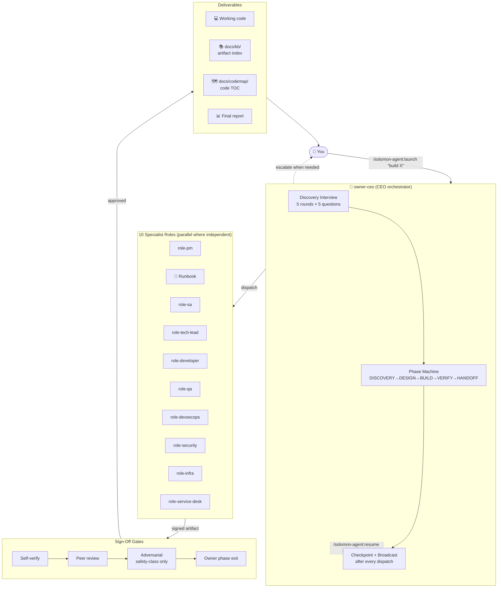

<div align="center">

# 👑 Solomon Agent

### *Wisdom by committee — a 10-agent virtual company in one slash command*

[](LICENSE)
[](https://claude.com/claude-code)
[](package.json)
[](CHANGELOG.md)
[](#-commands-14-total)
[](CHANGELOG.md)
[](CONTRIBUTING.md)

[Install](#-install) · [Quickstart](#-quickstart) · [Commands](#-commands-14-total) · [Architecture](#-architecture) · [Roadmap](#-roadmap) · [ภาษาไทย ↓](#-ภาษาไทย-thai)

</div>

---

## ✨ TL;DR

You type **one slash command**. Solomon Agent summons a virtual company of **10 specialist AI agents** — PM, BA, SA, Tech Lead, Developer, QA, DevSecOps, Security, Infra, Service Desk — coordinated by a **CEO orchestrator** that runs the full **DISCOVERY → DESIGN → BUILD → VERIFY → HANDOFF** lifecycle autonomously. Sign-off gates at every step. Resumable from any session drop. Auto-built knowledge base + code map. Natural-language router via `/solomon-agent:do`.

```
/solomon-agent:launch "build a SaaS appointment app for Thai barbershops"
```

That's it. The council convenes. You get back a working deliverable, a knowledge base of every decision, and a runbook to operate it.

---

## 🎯 Why Solomon Agent?

**The Problem.** Building software with AI today means juggling 50 different prompts, losing context every session drop, getting half-baked output because nobody asked the right questions at intake, and burning tokens on duplicate work because no agent knows what the others did.

**The Solution.** Solomon Agent gives Claude Code an **executive layer** — a wise meta-orchestrator that:

1. **Asks the right questions first** (Discovery Interview — up to 5 rounds, 10 dimensions)
2. **Decomposes work to 10 specialist roles** with clear charters and strict anti-scope
3. **Enforces sign-off gates** at every step (self → peer → owner → adversarial for safety-class)
4. **Demands creative + security mindset** (≥ 3 alternatives + STRIDE-on-everything per artifact)
5. **Checkpoints continuously** so any operator can resume mid-flight via `/solomon-agent:resume`
6. **Auto-builds the knowledge base + code map** so context never decays
7. **Surfaces cost transparently** — pre-flight estimate, mid-flight alerts, post-flight retrospective
8. **Routes natural-language intent** via `/solomon-agent:do` so you never memorize commands

Born from 20 rounds of audit (110 closed gaps + 5 strategic gaps) — battle-spec'd, not vibe-coded.

---

## 🚀 Key Features

| | Feature | What it does |
|---|---|---|
| 🎤 | **Discovery Interview** | Owner-CEO asks 3-5 clustered questions per round (up to 5 rounds) covering 10 dimensions before any role is dispatched — kills downstream rework |
| 🧑‍💼 | **Professional Consultant Agent** | After the interview, a per-project consultant persona is synthesized from the brief. Role agents route `## Needs-Input: type=CLARIFY` through it (batched up to 5, mandatory provenance + confidence + defer flag); deep questions get answered by a domain-grounded persona instead of always interrupting the user. See `design/consultant-feature.md`. |
| 🏛️ | **10-Role Virtual Company** | PM / BA / SA / Tech Lead / Developer / QA / DevSecOps / Security / Infra / Service Desk — each with charter, anti-scope, and verification checklist |
| ✅ | **Sign-Off Gates** | Every artifact: self-verify → peer review → owner phase-exit; safety-class artifacts get adversarial review too. Nothing ships unverified |
| 🧠 | **Creative + Security Mindset** | Rule of 3 (≥ 3 alternatives) + STRIDE-on-everything + assume-hostile-input + fail-closed + least-privilege + no-secrets-in-text |
| 💾 | **Resumable Checkpoints** | 7 triggers — role return / phase exit / feature complete / escalation / interview round / 15-min heartbeat / consultant built. `/solomon-agent:resume` continues from latest |
| 📚 | **Auto Knowledge Base** | Every artifact indexed in `docs/kb/` by phase / role / type / feature + decisions / risks / glossary + full-text search via `/solomon-agent:kb <query>` |
| 🗺️ | **Auto Codemap** | `docs/codemap/` rebuilt on every feature complete — modules, entry points, dependencies, public APIs across 8+ languages |
| 💰 | **Cost Transparency** | Pre-flight estimate (band: low—mid—high) → mid-flight burn alerts (50/80/95%) → per-feature retrospective with calibration |
| 🎯 | **Meta-Command Router** | `/solomon-agent:do "anything in Thai or English"` — reads state, classifies intent, asks back if ambiguous, routes to the right command. One command to rule them all |
| 🩺 | **Health Check** | `/solomon-agent:doctor` runs 17 checks (node version, manifests, scripts, hook schema, HMAC chain, role coverage, KB freshness, consultant profile staleness + ACL presence) — pre-flight before launch |
| 🔒 | **Defense in Depth** | HMAC chain on event log + atomic-rename writes + path-traversal guards + secret-pattern hooks + per-role ACLs |
| 🌏 | **Bilingual UX** | All escalation prompts + interview questions + meta-router keywords work in Thai AND English |

---

## 🏗️ Architecture



### Lifecycle (5 core phases + project-type variations)

```
                ┌───────────────────────────────────────────┐
                │  Discovery Interview (intake question)    │
                │  → state/artifacts/discovery-brief.md     │
                └─────────────────────┬─────────────────────┘
                                      ▼
DISCOVERY ──→ DESIGN ──→ BUILD ──→ VERIFY ──→ HANDOFF
   │             │          │         │           │
   │             │          │         └─[fail]─→  REWORK ─┐
   │             │          │                              │
   └────[brownfield code-map]                              │
                 │                                          │
                 └────[web-app]──→ DEPLOY (after VERIFY)   │
                 └────[data-pipeline]──→ DATA-MODEL        │
                 └────[mobile-app]──→ DESIGN-NATIVE        │
                                                            │
   ◄──────────────────────────────────────────────────────┘
   (rework loops back to appropriate phase per rollback protocol)
```

---

## 👥 The 10 Specialist Roles

| Role | Color | Model | Scope | Anti-scope (won't touch) |
|---|---|---|---|---|
| **role-pm** | 🔵 blue | sonnet | User stories, acceptance criteria, prioritization | Tech selection, architecture |
| **role-ba** | 🟢 green | sonnet | Domain modeling, project-type detection, glossary | Technical architecture, code |
| **role-sa** | 🟣 purple | opus | System design, integration map, ADRs | Module breakdown, security audit |
| **role-tech-lead** | 🔵 cyan | opus | Module breakdown, tech stack, conventions; brownfield code-map; arbiter | Writing code, test plan |
| **role-developer** | 🟡 yellow | sonnet | Implementation, self-review, unit tests | Deploy, push to remote |
| **role-qa** | 🟠 orange | sonnet | Test plan, test cases, regression, coverage | Implementation, security depth |
| **role-devsecops** | 🔴 red | sonnet | CI/CD pipeline, IaC, deploy stages, secret hooks | Threat modeling, runtime topology |
| **role-security** | 🔴 red | opus | Threat model, audit, SCA, secret scan, OWASP | Pipeline implementation |
| **role-infra** | ⚪ gray | sonnet | Runtime topology, scaling, observability, capacity | Deploy automation |
| **role-service-desk** | ⚪ white | haiku | Runbook, support docs, incident playbook, exec summary | Technical content production |
| | | | | |
| **owner-ceo** | 🟣 magenta | opus | Decompose / dispatch / collect / decide / escalate — orchestrator only | Doing role work itself |
| **backup-owner** | 🩷 pink | opus | User-triggered failover only (`/solomon-agent:failover`) | Automatic heartbeat (v0.1 limit) |

Full charters: [`rules/role-charters.md`](rules/role-charters.md) · [`docs/roles.md`](docs/roles.md)

---

## 📦 Install

### Prerequisites
- **Node.js ≥ 18** (no runtime npm deps — pure builtins)
- **Claude Code** with plugin support (`/plugin` command available)
- (Optional) **Git Credential Manager** if you'll customize and push your fork

### Install via Claude Code marketplace

```
/plugin marketplace add https://github.com/warnyin/solomon-agent
/plugin install solomon-agent@solomon-agent-marketplace
```

### Verify install

```
/solomon-agent:doctor
```

You should see 14-15 checks pass. If anything fails, see [Troubleshooting](#-troubleshooting).

---

## ⚡ Quickstart

### Your first project (3 commands)

```
/solomon-agent:doctor                                  # Pre-flight: confirm install OK
/solomon-agent:launch "build a markdown-to-PDF CLI"    # Discovery Interview starts
# … answer 3-5 questions per round, type "ลุย" or "go" to skip remaining
# … cost estimate shown → confirm with y/n/budget=<usd>
# … 10 roles work in parallel, signing off as they go
# … final deliverable + runbook at state/artifacts/final-report.md
```

### Don't want to remember 14 commands? Use one

```
/solomon-agent:do ดู status ปัจจุบัน              → routes to /solomon-agent:status
/solomon-agent:do ต่อจากที่หยุด                   → /solomon-agent:resume
/solomon-agent:do หา design เรื่อง auth          → /solomon-agent:kb auth
/solomon-agent:do owner ค้างมา 10 นาที            → /solomon-agent:failover
/solomon-agent:do build a Slack bot              → /solomon-agent:launch (with Discovery Interview)
```

---

## 🛠️ Commands (14 total)

### 🎯 Meta — one to rule them all
```bash
/solomon-agent:do "<anything in plain language>"   # Smart router: reads state, classifies intent,
                                        # asks back if ambiguous, routes to the right command.
                                        # Skip-remember mode for casual operators.
```

### 🩺 Health
```bash
/solomon-agent:doctor [--verbose] [--fix]          # 15-check plugin + project health check
```

### 🚀 Project Lifecycle
```bash
/solomon-agent:launch "<one-line goal>"            # Launch new project (Discovery Interview + cost pre-flight)
/solomon-agent:status                              # Live phase + active role + recent events
/solomon-agent:inject "<context/decision>"         # Push info to running orchestrator
/solomon-agent:abort                               # Graceful stop (state preserved for /solomon-agent:resume)
/solomon-agent:replay <PHASE>                      # Re-run a phase with new context
/solomon-agent:resume                              # Continue from latest checkpoint (after session drop)
/solomon-agent:failover                            # Swap to backup-owner (user-triggered)
```

### 📊 Observability
```bash
/solomon-agent:cost-report                         # Per-role token/cost breakdown + retrospective
/solomon-agent:stats                               # Cross-project success metrics
/solomon-agent:compact                             # Archive old artifacts + logs
```

### 📚 Knowledge Navigation
```bash
/solomon-agent:codemap [--rebuild] [--module X]    # View/rebuild code TOC (docs/codemap/)
/solomon-agent:kb [<query>] [--by-phase|role|type] # Browse/search artifact KB (docs/kb/)
```

Full command specs: [`commands/`](commands/)

---

## ⚙️ Configuration

Optional `sc.config.json` at project root:

```jsonc
{
  "budget": {
    "tokens_budget": 500000,
    "cost_estimate_usd_max": 20.00
  },
  "language": "th",                        // primary language for interview + escalations
  "escalation_relax": ["AMBIGUITY", "DEAD_END"],  // never relax safety-class
  "strictness": {
    "skip_peer_review": false,             // not recommended
    "skip_adversarial": false              // BLOCKED for safety-class regardless
  },
  "discovery_interview": {
    "skip": false                          // skip = high failure cost
  },
  "checkpoint": {
    "heartbeat_min": 15,
    "skip_role_return": false              // never recommended
  },
  "cost_transparency": {
    "preflight": true,
    "burn_alerts": true,
    "retrospective": true
  },
  "codemap": {
    "exclude_globs": ["dist/**", "build/**"]
  },
  "role_swap": {
    "role-developer": "agents/custom/role-rust-developer.md"
  },
  "extra_roles": [
    {
      "name": "role-ml-engineer",
      "tools": ["Read", "Write", "Bash"],
      "model": "opus",
      "color": "magenta",
      "charter_path": "rules/custom/role-ml-engineer-charter.md"
    }
  ]
}
```

Full schema: [`docs/configuration.md`](docs/configuration.md)

---

## 💡 Worked Example

User: `/solomon-agent:launch "build a Markdown-to-PDF CLI in Node.js"`

```
[$] PRE-FLIGHT COST ESTIMATE
  Goal:       "build a Markdown-to-PDF CLI in Node.js"
  Complexity: medium · type: cli · features: 1
  Expected:   ~140k tokens (~$1.26)
  Range:      $0.57 (lucky) — $3.78 (rough) with 80% confidence

Proceed? [y/n/budget=<usd>]
> y

[BLUE] DISCOVERY INTERVIEW — Round 1/5
WHO
1. Who is the primary user — developer scripting docs, or end-user clicking a UI?
WHAT
2. v0.1 features: which of [headings, lists, code blocks, images, math, custom CSS] must ship?
3. Reference CLIs you like (pandoc, md-to-pdf, mdpdf)?
WHY
4. Single biggest pain you're trying to remove?
confidence: who=0.3 what=0.4 why=0.4 ... overall=0.13

> developer scripting docs · headings + lists + code blocks + images · pandoc-like UX · pain = pandoc too heavy for CI

[BLUE] Round 2/5 — targeting LOW dimensions (when/where/how/edge/anti)
... 3 more rounds ...

[discovery-brief.md written · confidence=0.88 · 5 rounds]

DISCOVERY phase ──→ dispatch role-pm + role-ba (parallel)
[CHK] role-pm returned → checkpoint 01H... → peer-review by role-ba
[CHK] role-ba returned → checkpoint 01H... → peer-review by role-pm
[$] BURN — 18% used · 2.1k tok/min · projected final $1.40 (within range)

DESIGN phase ──→ role-sa + role-tech-lead + role-security (parallel)
... arbiter resolved 1 conflict (Markdown parser: remark vs marked vs custom) — picked remark ...

BUILD phase ──→ role-developer (1 module)
[CHK] role-developer returned → peer: role-qa + role-security (safety-class for file-output)
... role-security adversarial: replay-safe file paths, no eval, sandboxed PDF gen ...

VERIFY phase ──→ role-qa (tests) + role-devsecops (CI) + role-security (audit)
[CHK] all approved · phase exit checks PASS

[GREEN] FEATURE COMPLETE — F-001
- Artifacts: 11 (brief, PRD, domain, design, threat, infra, tech-plan, code, tests, runbook, exec-summary)
- Codemap rebuilt → docs/codemap/index.md (8 files, 4 modules)
- KB rebuilt → docs/kb/index.md (11 artifacts indexed)
- Final report → state/artifacts/final-report.md
- Cost: $1.43 (estimate was $1.26 — variance +13%, within band)
- Next: pnpm install && ./bin/md2pdf input.md
```

You walk away with: **working CLI** + tests + runbook + every decision documented + searchable knowledge base — for ~$1.43.

---

## 💰 Cost Transparency

Three surfaces (per [`rules/cost-transparency-protocol.md`](rules/cost-transparency-protocol.md)):

| Surface | When | What it shows |
|---|---|---|
| **Pre-flight** | Before `/solomon-agent:launch` dispatches owner | Expected tokens + USD with low—mid—high bands · 80% confidence · based on heuristic-v1 + memory MCP samples |
| **Mid-flight** | Every checkpoint trigger | `[$] BURN — N% used · X k tok/min · projected $Y` + threshold alerts (50/80/95%) + 3× spike detector |
| **Retrospective** | At HANDOFF | Per-feature + per-role breakdown · estimate vs actual · calibration update to memory MCP |

You never face a surprise bill.

---

## 🔒 Sign-Off Gates (Strictness)

Every artifact MUST pass (per [`rules/role-strictness-protocol.md`](rules/role-strictness-protocol.md)):

```
draft → ready_for_review → approved
   ↑           ↓
   └─ rejected (peer found issues; back to producer)
```

| Level | Who | When | Required for |
|---|---|---|---|
| **self** | Producing role | Before `ready_for_review` | All artifacts |
| **peer** | Sibling per matrix | Before `approved` | All artifacts |
| **adversarial** | role-security or role-qa (red-team lens) | Before phase exit | Safety-class only (security-audit, threat-model, pipeline, prod runbook, auth/payments/PII code) |
| **owner** | owner-ceo | At phase exit | All required phase artifacts |

**Token cost multiplier:** ~2.0× baseline (~2.5× for safety-class) — surfaced in pre-flight estimate.

Failure: `failed_items[]` non-empty + no waiver → escalate `VERIFICATION_FAILED` (escalation #15).

Checklists per role: [`templates/role-verification-checklists.md`](templates/role-verification-checklists.md)

---

## 💾 Resumable Hand-Offs

Per [`rules/handoff-checkpoint-protocol.md`](rules/handoff-checkpoint-protocol.md):

| Checkpoint Trigger | When |
|---|---|
| `role_return` | After ANY role's Agent call returns |
| `phase_exit` | Before transitioning phase (also rebuilds KB + codemap) |
| `feature_complete` | When deliverable passes VERIFY |
| `escalation_emitted` | When `[YELLOW] ESCALATION` is surfaced |
| `interview_round_end` | After each Discovery Interview round |
| `time_threshold` | Every 15min wall-clock (heartbeat) |

Resume after session drop:
```
/solomon-agent:resume
```

Idempotent — safe to invoke repeatedly. Every role reads `state/role-state-board.json` and refuses dispatch unless it's their turn (no premature work).

---

## 📚 Knowledge Base + Codemap

Auto-built on every `feature_complete` or `phase_exit`:

### `docs/kb/` — Artifact index
```
docs/kb/
├── index.md
├── by-phase/      (DISCOVERY.md, DESIGN.md, BUILD.md, VERIFY.md, HANDOFF.md)
├── by-role/       (role-pm.md, role-ba.md, ... ×10)
├── by-type/       (prd.md, design.md, code.md, runbook.md, ...)
├── by-feature/    (F-001.md, F-002.md, ...)
├── decisions.md   (every ADR + waiver extracted)
├── risks.md       (every Open/Accepted risk)
├── glossary.md    (merged from role-ba domain-models)
└── search-index.json  (substring search via /solomon-agent:kb <query>)
```

### `docs/codemap/` — Code TOC
```
docs/codemap/
├── index.md
├── by-module/     (one per module)
├── by-feature/    (files touched per feature)
├── entry-points.md
└── manifest.json
```

Supports: TypeScript / JavaScript / Python / Go / Rust / Java / Kotlin / Swift / C/C++ / Ruby / PHP

---

## 🚦 Escalation Conditions (15 total)

Per [`rules/escalation.md`](rules/escalation.md). Owner halts and asks YOU only on declared conditions — never silently for noise:

| # | Condition | Class | Relaxable? |
|---|---|---|---|
| 1 | AMBIGUITY | Decision | ✅ |
| 2 | DECISION_GATE | Safety | ❌ |
| 3 | SAFETY | Safety | ❌ |
| 4 | SCOPE_EXPLOSION | Safety | ❌ |
| 5 | DEAD_END | Decision | ✅ |
| 6 | BUDGET_WARNING / EXCEEDED | Safety | ❌ |
| 7 | INJECTION_DETECTED | Safety | ❌ |
| 8 | MULTI_USER_LOCK | Safety | ❌ |
| 9 | STATE_VERSION_MISMATCH | Safety | ❌ |
| 10 | LANGUAGE_DOWNGRADE_PROPOSAL | UX | ✅ |
| 11 | LONG_SESSION_WARNING | UX | (auto) |
| 12 | DEPENDENCY_VERSION_MISMATCH | UX | ✅ |
| 13 | MIGRATION_INTEGRITY_FAILURE | Safety | ❌ |
| 14 | MCP_AUTH | Safety | ❌ |
| 15 | VERIFICATION_FAILED | Safety | ❌ |

---

## 🆘 Troubleshooting

| Symptom | Fix |
|---|---|
| `/plugin` command not found | Update Claude Code (`npm install -g @anthropic-ai/claude-code`) |
| `marketplace add` says "not found" | Repo must be **public** on GitHub; check URL + spelling |
| `/solomon-agent:doctor` reports `hmac_chain: fail` | Don't auto-fix — investigate; possibly corruption — `/solomon-agent:abort` + restart |
| Owner stuck > 10min | `/solomon-agent:failover` swaps to backup-owner |
| Budget exceeded mid-flight | `/solomon-agent:status` → adjust `sc.config.json:budget` → `/solomon-agent:abort` + resume |
| State too large | `/solomon-agent:compact` archives old artifacts |
| Codemap looks stale | `/solomon-agent:doctor --fix` rebuilds it |
| Want to inspect events | `node scripts/verify-log.mjs` confirms HMAC chain integrity |
| Uninstall completely | `node scripts/uninstall.mjs` then `/plugin uninstall solomon-agent` |

---

## 🚧 v0.1 Limitations (be honest)

- ❌ **No automatic owner liveness detection** — user invokes `/solomon-agent:failover` manually
- ❌ **Determinism = structural only**, not prose-level reproducibility
- ❌ **Budget tracking may degrade to char-heuristic** if Claude Code Agent tool doesn't surface child usage
- ❌ **Write-path enforcement = best-effort**, not adversarial (LLM has FS access)
- ❌ **HMAC chain protects against accidental tampering only**, not filesystem-level attackers
- ❌ **Single-host lock** — multi-host concurrent operators not supported in v0.1
- ❌ **i18n hardcoded TH + EN** — other languages need extension
- ❌ **CI eval driver is dry-run only** — live agent eval requires manual invocation
- ❌ **Memory MCP unbounded** — pruning policy in v0.2+

Full audit: [`docs/architecture.md#v01-limitations`](docs/architecture.md)

---

## 🗺️ Roadmap

### v0.2 (next minor)
- Automatic owner heartbeat (when/if Claude Code adds supervisor API)
- Real concurrency for parallel BUILD via worktrees (proven, not just specified)
- `/solomon-agent:undo` last-action revert + `/solomon-agent:diff` artifact comparison
- `/solomon-agent:export` project bundling for non-sc operators
- `/solomon-agent:lessons` query memory MCP Lesson entities
- Memory MCP pruning + cross-project dedup
- i18n beyond TH+EN (JA, ZH, ES, FR, DE — community PRs welcome)

### v0.3+ (research)
- Cross-LLM portability (Cursor / Codex / Gemini operators)
- Web dashboard for non-CLI operators
- A/B prompt evolution per role (learned weights for cost heuristic)
- Multi-project workspace
- Plugin auto-update mechanism with safe state preservation

---

## 🤝 Contributing

PRs welcome! Start with [CONTRIBUTING.md](CONTRIBUTING.md).

Adding things:
- 🧑 [Add a role agent](docs/extending-add-role.md) — 7-step cookbook
- ⚡ [Add a `/solomon-agent:*` command](docs/extending-add-command.md) — 5-step cookbook
- 🧠 [Add a cognitive skill](docs/extending-add-skill.md) — 4-step cookbook

Code of Conduct: [CODE_OF_CONDUCT.md](CODE_OF_CONDUCT.md)
Vulnerability disclosure: [SECURITY.md](SECURITY.md)
Privacy stance: [docs/telemetry-policy.md](docs/telemetry-policy.md) — **zero telemetry by default**

---

## ❓ FAQ

**Q: Will this replace me as a developer?**
A: No. It accelerates the boring parts (scaffolding, lifecycle paperwork, sign-off) so you spend time on the hard parts (real decisions, novel design, taste).

**Q: How is this different from CrewAI / LangGraph / mbruhler/claude-orchestration?**
A: Solomon Agent runs natively inside Claude Code (no separate Python runtime). It's spec-first (rules + skills are LLM-readable), not framework-first. See [`docs/comparison.md`](docs/comparison.md).

**Q: Does it work for non-software projects (research, writing, ops)?**
A: Yes — project_type detection adjusts role activation. Research / docs projects skip BUILD-heavy roles.

**Q: How much does a typical project cost?**
A: Small CLI (1 feature): ~$1-3. Medium web-app (3 features): ~$10-25. Large platform (10+ features): $50-200. Pre-flight gives a band before you commit.

**Q: Can I use my own models per role?**
A: Yes — `sc.config.json: role_swap` lets you point any role to your custom agent file.

**Q: What if I want only some of the 10 roles?**
A: project_type templates already do this. Or override in `sc.config.json`.

**Q: Is it safe to run on a production repo?**
A: It defaults to read-only on existing code (`existing-codebase-protocol`). `role-developer` charter explicitly forbids `git push`. Always review before merging.

**Q: Why "Solomon"?**
A: King Solomon, famed for wise judgment + decisive verdicts. Plus, "solo" command pun (one command rules all). The plugin convenes a council and ships the verdict.

---

## 🙏 Acknowledgments

Reference architecture: [affaan-m/ECC](https://github.com/affaan-m/ECC) v2.0 plugin layout.

Prior art reviewed:
- [mbruhler/claude-orchestration](https://github.com/mbruhler/claude-orchestration)
- [bobmatnyc/claude-mpm](https://github.com/bobmatnyc/claude-mpm)
- [josephneumann/claude-corps](https://github.com/josephneumann/claude-corps)
- [suxxes/resin.ai](https://github.com/suxxes/resin.ai)
- [barkain/claude-code-workflow-orchestration](https://github.com/barkain/claude-code-workflow-orchestration)

Built with care for the Claude Code community.

---

## 📜 License

MIT — see [LICENSE](LICENSE)

Copyright © 2026 ArmLazySong

---

<div align="center">

⭐ **Star** this repo if Solomon Agent saves you time
🐛 [Report a bug](.github/ISSUE_TEMPLATE/bug.yml) · ✨ [Request a feature](.github/ISSUE_TEMPLATE/feature.yml) · 🔐 [Security disclosure](SECURITY.md)

</div>

---
---

<div align="center">

# 🇹🇭 ภาษาไทย (Thai)

</div>

## ✨ สรุปสั้น

พิมพ์ **slash command เดียว** Solomon Agent จะเรียก **AI specialist 10 ตัว** มาทำงานเป็น virtual company — PM, BA, SA, Tech Lead, Developer, QA, DevSecOps, Security, Infra, Service Desk — มี **CEO orchestrator** คุมให้รัน lifecycle เต็มรอบ **DISCOVERY → DESIGN → BUILD → VERIFY → HANDOFF** อย่างอัตโนมัติ มี sign-off gate ทุกขั้น, resume ได้หลัง session หลุด, สร้าง knowledge base + code map ให้อัตโนมัติ, มี natural-language router `/solomon-agent:do`

```
/solomon-agent:launch "ทำ SaaS จองคิวร้านตัดผมไทย"
```

แค่นี้ — สภาประชุม คืนผลลัพธ์เป็น deliverable ใช้งานได้จริง พร้อม KB ของทุกการตัดสินใจ + runbook สำหรับ operate

---

## 🎯 ทำไมต้องใช้ Solomon Agent

**ปัญหา.** สร้าง software ด้วย AI ทุกวันนี้ต้องจำ prompt 50 แบบ, ทุก session ที่หลุดเสีย context ใหม่หมด, output ออกมา half-baked เพราะไม่มีใครถามคำถามถูกต้องตั้งแต่ intake, ไหม้ tokens เพราะ agent ทำงานซ้ำกัน

**ทางออก.** Solomon Agent ให้ **executive layer** กับ Claude Code — meta-orchestrator ที่:

1. **ถามคำถามถูกตั้งแต่ต้น** (Discovery Interview สูงสุด 5 รอบ, 10 dimensions)
2. **แบ่งงานเป็น 10 specialist roles** มี charter + anti-scope ชัด
3. **บังคับ sign-off gates** ทุกขั้น (self → peer → owner → adversarial สำหรับ safety-class)
4. **ต้อง creative + security mindset** (≥ 3 ทางเลือก + STRIDE-on-everything)
5. **Checkpoint บ่อย** — `/solomon-agent:resume` ต่อจากจุดที่หยุด
6. **Auto-build KB + codemap** — context ไม่หาย
7. **โปร่งใสเรื่อง cost** — pre-flight estimate, mid-flight alerts, retrospective
8. **Route natural-language** ผ่าน `/solomon-agent:do` — ไม่ต้องจำ command

ผ่าน 20 รอบของ audit (110 closed gaps + 5 strategic gaps) — spec-driven ไม่ใช่ vibe-coded

---

## 🚀 Features หลัก

| | Feature | คืออะไร |
|---|---|---|
| 🎤 | **Discovery Interview** | Owner-CEO ถาม 3-5 คำถามต่อรอบ (สูงสุด 5 รอบ) ครอบคลุม 10 มิติ ก่อน dispatch role ใดๆ — กัน rework |
| 🏛️ | **10-Role Virtual Company** | PM / BA / SA / Tech Lead / Developer / QA / DevSecOps / Security / Infra / Service Desk |
| ✅ | **Sign-Off Gates** | ทุก artifact: self → peer → owner; safety-class +adversarial. ไม่มีอะไรผ่านโดยไม่ตรวจ |
| 🧠 | **Creative + Security Mindset** | Rule of 3 + STRIDE + assume-hostile-input + fail-closed + least-privilege + no-secrets-in-text |
| 💾 | **Resumable Checkpoints** | 6 triggers; `/solomon-agent:resume` ต่อจาก checkpoint ล่าสุด |
| 📚 | **Auto Knowledge Base** | ทุก artifact index ใน `docs/kb/` by-phase/role/type/feature + decisions/risks/glossary + ค้น via `/solomon-agent:kb <query>` |
| 🗺️ | **Auto Codemap** | `docs/codemap/` rebuild ทุก feature complete — รองรับ 8+ ภาษา |
| 💰 | **Cost Transparency** | Pre-flight (band low—mid—high) → mid-flight alerts (50/80/95%) → retrospective + calibration |
| 🎯 | **Meta-Command Router** | `/solomon-agent:do "พิมพ์อะไรก็ได้"` — อ่าน state, classify intent, ถามกลับถ้าไม่แน่ใจ |
| 🩺 | **Health Check** | `/solomon-agent:doctor` ตรวจ 15 ข้อ — manifests, scripts, hooks, HMAC, KB freshness |
| 🔒 | **Defense in Depth** | HMAC chain + atomic-rename + path-traversal guards + secret-pattern hooks + per-role ACLs |
| 🌏 | **2 ภาษา** | Escalation + Interview + Meta-router keyword ใช้ได้ทั้ง ไทย และ อังกฤษ |

---

## 📦 ติดตั้ง

### Pre-requisite
- Node.js ≥ 18
- Claude Code ที่มี `/plugin` command

### ขั้นตอน

```
/plugin marketplace add https://github.com/warnyin/solomon-agent
/plugin install solomon-agent@solomon-agent-marketplace
```

### ตรวจสอบ

```
/solomon-agent:doctor
```

ต้องเห็น 14-15 checks ผ่าน

---

## ⚡ เริ่มใช้งาน

```
/solomon-agent:doctor                                    # ตรวจ install
/solomon-agent:launch "ทำ CLI แปลง markdown เป็น PDF"   # Discovery Interview เริ่ม
# ตอบ 3-5 คำถามต่อรอบ พิมพ์ "ลุย" เพื่อข้าม
# Cost estimate แสดง → confirm y/n/budget=<usd>
# 10 roles ทำงานขนาน sign-off ทุกขั้น
# Final report ที่ state/artifacts/final-report.md
```

### ขี้เกียจจำ command? ใช้ตัวเดียว

```
/solomon-agent:do ดู status ปัจจุบัน              → /solomon-agent:status
/solomon-agent:do ต่อจากที่หยุด                   → /solomon-agent:resume
/solomon-agent:do หา design เรื่อง auth          → /solomon-agent:kb auth
/solomon-agent:do owner ค้างมา 10 นาที            → /solomon-agent:failover
/solomon-agent:do ทำ Slack bot                  → /solomon-agent:launch (พร้อม Discovery Interview)
```

---

## 🛠️ Commands (14 ตัว)

### 🎯 Meta
- `/solomon-agent:do "<พิมพ์อะไรก็ได้>"` — router ตัวเดียวรู้ทุกอย่าง

### 🩺 Health
- `/solomon-agent:doctor [--verbose] [--fix]` — 15-check health

### 🚀 Lifecycle
- `/solomon-agent:launch "<goal>"` — เริ่ม project (Discovery Interview + cost pre-flight)
- `/solomon-agent:status` — phase + active role + events ล่าสุด
- `/solomon-agent:inject "<context>"` — ส่งข้อมูลเพิ่มเข้า orchestrator
- `/solomon-agent:abort` — หยุดอย่างนุ่มนวล (state ยังอยู่)
- `/solomon-agent:replay <PHASE>` — รัน phase ใหม่
- `/solomon-agent:resume` — ต่อจาก checkpoint ล่าสุด
- `/solomon-agent:failover` — swap ไป backup-owner

### 📊 Observability
- `/solomon-agent:cost-report` — token/cost ต่อ role + retrospective
- `/solomon-agent:stats` — metrics ข้าม project
- `/solomon-agent:compact` — archive logs/artifacts เก่า

### 📚 Knowledge
- `/solomon-agent:codemap [--rebuild]` — view/rebuild code TOC
- `/solomon-agent:kb [<query>]` — browse/search artifact KB

---

## ⚙️ ปรับแต่ง

สร้าง `sc.config.json` ที่ project root:

```json
{
  "budget": { "tokens_budget": 500000, "cost_estimate_usd_max": 20.00 },
  "language": "th",
  "escalation_relax": ["AMBIGUITY", "DEAD_END"],
  "discovery_interview": { "skip": false }
}
```

Schema เต็ม: [`docs/configuration.md`](docs/configuration.md)

---

## 💰 ความโปร่งใสเรื่อง Cost

3 จุด:

| จุด | เมื่อไหร่ | แสดงอะไร |
|---|---|---|
| **Pre-flight** | ก่อน `/solomon-agent:launch` | Expected tokens + USD band (low—mid—high) |
| **Mid-flight** | ทุก checkpoint | `[$] BURN — N% used · X k tok/min · projected $Y` + alerts |
| **Retrospective** | ที่ HANDOFF | per-feature + per-role + estimate vs actual + calibration |

---

## 🚧 ข้อจำกัด v0.1

- ❌ ไม่มี automatic owner liveness — ต้อง `/solomon-agent:failover` เอง
- ❌ Determinism = structural เท่านั้น
- ❌ Budget tracking อาจเป็น char-heuristic
- ❌ Write-path enforcement = best-effort
- ❌ HMAC chain ป้องกัน accidental เท่านั้น
- ❌ Single-host lock — multi-host รอ v0.2
- ❌ i18n ไทย+อังกฤษ เท่านั้น

---

## 🗺️ Roadmap

**v0.2:** automatic owner heartbeat, real parallel BUILD, `/solomon-agent:undo`, `/solomon-agent:diff`, `/solomon-agent:export`, `/solomon-agent:lessons`, memory MCP pruning, i18n เพิ่มภาษา

**v0.3+:** cross-LLM portability, web dashboard, A/B prompt evolution, multi-project workspace

---

## 🆘 Troubleshooting

| ปัญหา | วิธีแก้ |
|---|---|
| `/plugin` ไม่มี | `npm install -g @anthropic-ai/claude-code` |
| `marketplace add` ไม่เจอ | Repo ต้อง public บน GitHub |
| Owner ค้าง > 10 นาที | `/solomon-agent:failover` |
| Budget เกิน | `/solomon-agent:status` → แก้ config → `/solomon-agent:abort` + resume |
| State ใหญ่ | `/solomon-agent:compact` |
| Uninstall | `node scripts/uninstall.mjs` แล้ว `/plugin uninstall solomon-agent` |

---

## 🤝 ร่วมพัฒนา

PR ยินดีต้อนรับ! เริ่มที่ [CONTRIBUTING.md](CONTRIBUTING.md)

Cookbooks:
- 🧑 [เพิ่ม role agent](docs/extending-add-role.md) — 7 ขั้นตอน
- ⚡ [เพิ่ม `/solomon-agent:*` command](docs/extending-add-command.md) — 5 ขั้นตอน
- 🧠 [เพิ่ม cognitive skill](docs/extending-add-skill.md) — 4 ขั้นตอน

[Code of Conduct](CODE_OF_CONDUCT.md) · [Security disclosure](SECURITY.md) · [Telemetry policy](docs/telemetry-policy.md) (zero by default)

---

## 📜 License

MIT — Copyright © 2026 ArmLazySong

---

<div align="center">

⭐ **Star** repo นี้ถ้า Solomon Agent ประหยัดเวลาคุณ

Made with 💛 for the Claude Code community

</div>
