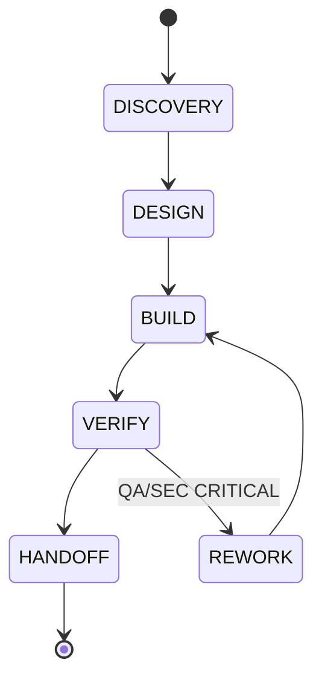

# Architecture

## High-Level Sequence

```mermaid
sequenceDiagram
    User->>/solomon-agent:launch: "build XYZ"
    /solomon-agent:launch->>owner-ceo: Agent dispatch
    owner-ceo->>role-pm: DISCOVERY parallel
    owner-ceo->>role-ba: DISCOVERY parallel
    role-pm-->>owner-ceo: prd artifact
    role-ba-->>owner-ceo: domain + project_type
    owner-ceo->>role-sa: DESIGN
    role-sa-->>owner-ceo: architecture
    owner-ceo->>role-developer: BUILD (isolation:worktree)
    role-developer-->>owner-ceo: code artifact
    owner-ceo->>role-qa: VERIFY
    role-qa-->>owner-ceo: test-report
    owner-ceo->>role-service-desk: HANDOFF
    role-service-desk-->>owner-ceo: runbook + exec-summary
    owner-ceo->>User: final-report.md
```

## Phase State Machine



Project-type-specific insertions per `rules/project-templates.md`:
- web-app: + DEPLOY after VERIFY
- data-pipeline: + DATA-MODEL before DESIGN
- mobile-app: + DESIGN-NATIVE after DESIGN

## File Layout

```
.claude-plugin/{plugin.json,marketplace.json}
agents/{owner-ceo,backup-owner,role-*}.md       (12 agents)
commands/{launch,status,inject,abort,replay,failover,cost-report,compact,stats}.md
rules/{role-charters,escalation,communication-protocol,...}.md
skills/{meta-orchestration,escalation-protocol,shared-state}/SKILL.md
hooks/hooks.json
scripts/{state-store,guard-*,validate-*,session-*,post-agent,...}.mjs
scripts/lib/{ulid,paths}.mjs
scripts/migrations/{MANIFEST.json,test-harness.mjs}
docs/, tests/, .github/workflows/
```

## v0.1 Limitations (honest)

- **No automatic owner liveness** — user invokes `/solomon-agent:failover` (Round 6 #89)
- **Determinism = structural reproducibility** — Agent API has no seed/temp (Round 7 #95)
- **Budget tracking degrades to char-heuristic** if no usage exposed (Round 7 #94)
- **Write-path enforcement = best-effort** — LLM has FS access (Round 8 #97)
- **HMAC chain vs ACCIDENTAL only** — filesystem attackers can rewrite key + chain (Round 6 #90)
- **Single-host lock** — v0.2 for multi-host

## Reference

- Plan: `.claude/PRPs/plans/meta-agent-orchestrator.plan.md` (110 gaps closed across 9 rounds)
- ECC pattern source: github.com/affaan-m/ECC v2.0-rc.1
